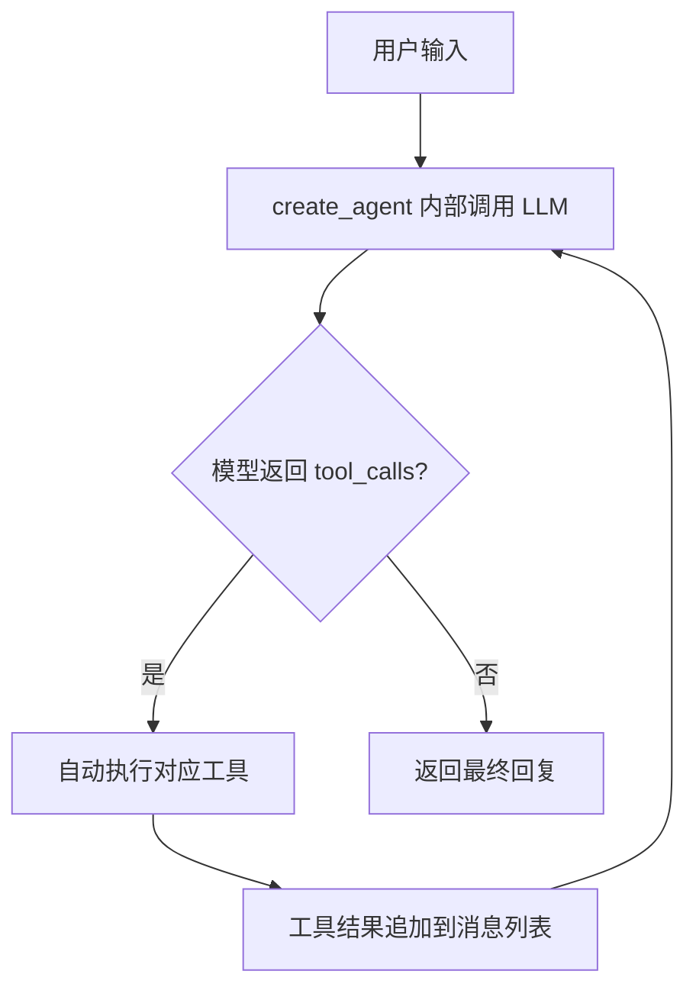
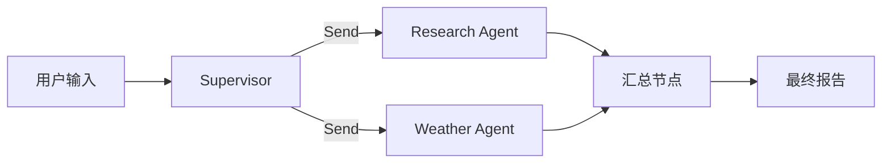
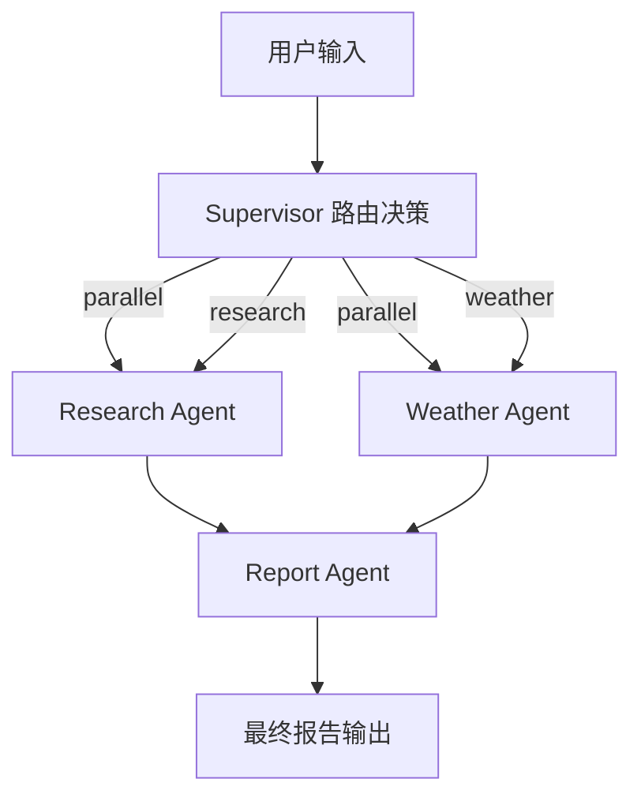
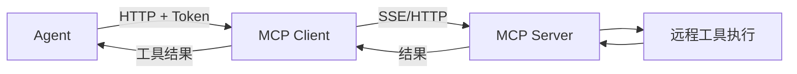

# AI-Agent-Lib

基于 LangChain + LangGraph 构建的 Agent 示例库，支持本地 Ollama 模型及远程 API。包含单 Agent ReAct、多 Agent 并行编排、MCP 远程工具调用三种模式。

## 环境要求

- Python >= 3.12
- [uv](https://docs.astral.sh/uv/) 包管理器
- [Ollama](https://ollama.com/) 已安装并运行（本地模型场景）
- 模型已拉取：`ollama pull gemma4:e4b`

## 快速开始

```bash
# 克隆项目后安装依赖
uv sync

# 复制环境变量模板并按需填写
cp .env.example .env

# 运行示例
uv run react-agent       # 单 Agent ReAct
uv run multi-agent       # 多 Agent 并行编排
uv run mcp-agent         # MCP 远程工具调用
```

## 项目结构

```
AI-Agent-Lib/
├── agent_lib/            # 核心库
│   ├── __init__.py        # 包入口，导出 get_llm 及工具
│   ├── config.py          # 统一配置：加载 .env、设置代理、LLM 工厂
│   └── tools.py           # 可复用工具定义
├── examples/              # 示例脚本
│   ├── react_agent.py     # 单 Agent — create_agent 自动 ReAct 循环
│   ├── multi_agent.py     # 多 Agent — Supervisor + Send 并行 fan-out
│   └── mcp_agent.py       # MCP 远程工具调用（HTTP + Bearer Token）
├── .env.example           # 环境变量模板
├── .gitignore
├── pyproject.toml         # 项目元数据、依赖、脚本入口
└── README.md
```

## 配置

通过 `.env` 文件或环境变量控制 LLM 后端：

| 变量 | 默认值 | 说明 |
|------|--------|------|
| `LLM_MODEL` | `gemma4:e4b` | 模型名称 |
| `LLM_PROVIDER` | `ollama` | 模型提供方 (`ollama` / `openai` / …) |
| `LLM_BASE_URL` | `http://localhost:11434` | API 地址 |
| `LLM_TEMPERATURE` | `0.7` | 采样温度 |
| `MCP_URL` | — | MCP 服务端 URL |
| `MCP_TOKEN` | — | MCP Bearer Token |

> **注意**：如果本机有 HTTP 代理，`config.py` 会自动设置 `NO_PROXY=localhost,127.0.0.1` 以避免本地请求被代理拦截。

---

## 示例说明

### 1. react_agent — 单 Agent 自动 ReAct

使用 `create_agent()` 高层 API 自动实现 ReAct 循环（LLM → 工具调用 → LLM → … → 最终回复），内置 `InMemorySaver` 支持多轮对话。



**可用工具**：`get_weather(city)` · `add(a, b)` · `multiply(a, b)` · `divide(a, b)` · `search_web(query)`

### 2. multi_agent — 多 Agent 并行编排

Supervisor 节点根据任务动态分发，通过 `Send` 实现 fan-out 并行调用多个子 Agent，结果汇总后生成最终报告。



### 3. mcp_agent — MCP 远程工具调用

通过 `langchain-mcp-adapters` 连接远程 MCP 服务，使用 HTTP StreamableHTTP + Bearer Token 认证获取工具列表并调用。

---

## 开发

```bash
# 以开发模式安装（可编辑）
uv sync

# 直接运行示例文件
uv run python examples/react_agent.py
```

---

## multi_agent.py — 多 Agent 并行编排

### 架构

使用 LangGraph `StateGraph` + `Send` 实现 **Supervisor 模式**：由 Supervisor 节点路由，通过返回多个 `Send` 对象实现 Agent 并行执行（fan-out），最终由 Report Agent 汇总。

### 执行流程



### 节点说明

| 节点 | 职责 |
|------|------|
| `supervisor` | 分析用户意图，决定路由（parallel / research / weather） |
| `research` | 调用 `search_web` 工具搜索信息 |
| `weather` | 调用 `get_weather` 工具查询天气 |
| `report` | 汇总所有 Agent 结果，调用 LLM 生成中文总结报告 |

### 并行机制

```python
# 条件边返回多个 Send = 并行执行
def fan_out_to_agents(state):
    if next_step == "parallel":
        return [Send("research", state), Send("weather", state)]
```

- `Send` 是 LangGraph 的并行原语，多个 Send 由运行时并发调度
- 并行节点的输出通过 `Annotated[list, operator.add]` 自动合并到共享 State

### 共享状态

```python
class AgentState(TypedDict):
    messages: Annotated[list[BaseMessage], operator.add]  # 自动合并
    research_result: str   # Research Agent 输出
    weather_result: str    # Weather Agent 输出
    final_report: str      # Report Agent 输出
    next_step: str         # Supervisor 路由决策
```

---

## mcp_agent.py — MCP 远程工具调用

### 概述

通过 [Model Context Protocol (MCP)](https://modelcontextprotocol.io/) 连接远程工具服务器，在 HTTP 请求头中携带 Bearer Token 进行认证，Agent 自动发现并调用远程工具。

### 运行方式

```bash
# 设置环境变量
$env:MCP_SERVER_URL="http://your-server:8080/mcp/sse"
$env:MCP_TOKEN="your-auth-token"

# 运行
uv run mcp_agent.py
```

### 支持的传输方式

| 方式 | 说明 | 需要 Token |
|------|------|------|
| **SSE** (`sse`) | HTTP Server-Sent Events，适合远程服务 | ✅ |
| **Streamable HTTP** (`streamable_http`) | MCP 新版推荐协议 | ✅ |
| **stdio** | 本地子进程，适合开发调试 | ❌ |

### Token 认证机制

```python
async with MultiServerMCPClient({
    "remote_server": {
        "transport": "sse",
        "url": "http://your-server/mcp/sse",
        # ★ 在 HTTP 请求头中携带 Bearer Token
        "headers": {
            "Authorization": f"Bearer {token}",
        },
        "timeout": 30,
    }
}) as client:
    tools = client.get_tools()  # 自动发现远程工具
```

### 执行流程



### 多 Server 连接

`MultiServerMCPClient` 支持同时连接多个 MCP Server，每个 Server 可配置独立的 URL 和认证信息：

```python
{
    "server_a": {"transport": "sse", "url": "...", "headers": {...}},
    "server_b": {"transport": "streamable_http", "url": "...", "headers": {...}},
    "local":    {"transport": "stdio", "command": "npx", "args": [...]},
}
```

---

## 注意事项

1. **代理绕过** — 脚本开头设置了 `NO_PROXY=localhost,127.0.0.1`，防止本地 Ollama 请求被系统 HTTP 代理拦截（502 错误）。无代理环境下此行无害。
2. **多轮对话** — `main.py` 配置了 `InMemorySaver` + `thread_id`，同一 thread 下多次 invoke 共享对话历史。
3. **扩展工具** — 定义 `@tool` 函数加入 `tools` 列表即可，`create_agent` 自动注册。
4. **扩展 Agent** — 在 `multi_agent.py` 中添加新节点 + `graph.add_node()`，并在 `fan_out_to_agents` 加入对应 `Send` 即可并行。

## 依赖

```
langchain[openai]         >= 1.3.2
langchain-ollama          >= 1.1.0
langchain-mcp-adapters    >= 0.2.2
langgraph                 >= 1.2.2
openai                    >= 2.38.0
ollama                    >= 0.6.2
```
